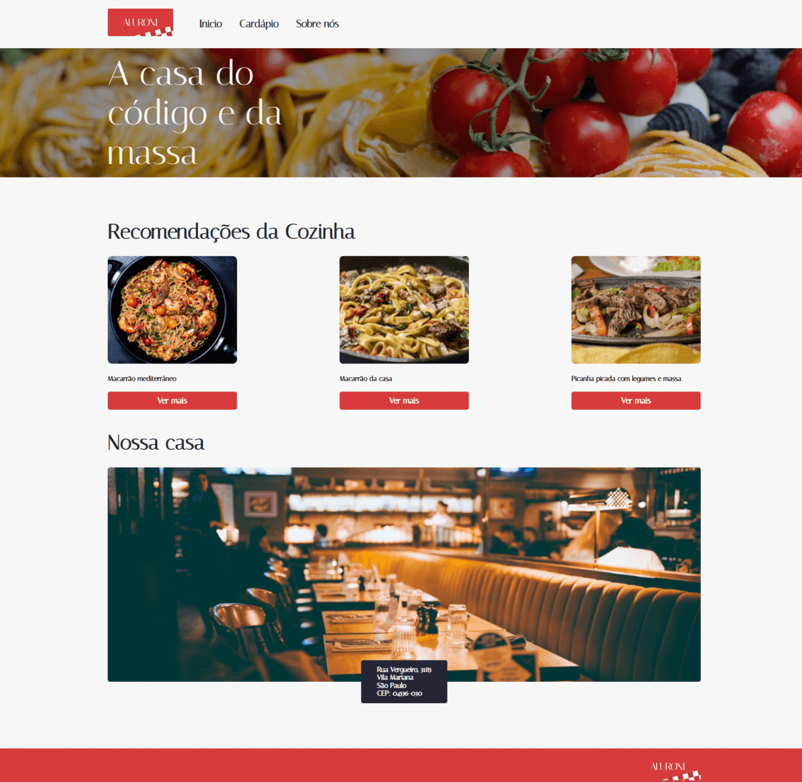

# Cardápio Aluroni



## Menu

- [Layout](#layout)
- [Descrição](#descrição)
  - [Principais recursos incluem](#principais-recursos-incluem)
- [Tecnologias Utilizadas](#tecnologias-utilizadas)
- [Estrutura de Pastas](#estrutura-de-pastas)
  - [Arquivos Principais](#arquivos-principais)
- [Como Instalar e Rodar o Projeto](#como-instalar-e-rodar-o-projeto)
  - [Configuração](#configuração)
  - [Casos de Uso Comuns](#casos-de-uso-comuns)
  - [Solução de Problemas](#solução-de-problemas)
- [Projeto ao Vivo](#projeto-ao-vivo)
- [Fluxo de Dados](#fluxo-de-dados)
- [Licença](#licença)
- [Autor](#autor)

## Layout

[Layout no Figma](https://www.figma.com/file/Atxu1zBvhmdTGEeTQHZlHD/Aluroni-Layout)

## Descrição

Este projeto é uma aplicação React que simula um cardápio digital para um restaurante chamado Aluroni. A aplicação permite aos usuários navegar pelo cardápio, filtrar itens por categoria, realizar buscas por nome de pratos e ordenar os resultados por diferentes critérios como preço, porção e quantidade de pessoas que serve.

O projeto foi desenvolvido com React e TypeScript, utilizando módulos CSS para estilização e implementando boas práticas de desenvolvimento como componentização e hooks.

### Principais recursos incluem:

- Navegação entre páginas utilizando React Router
- Filtros dinâmicos por categoria de alimentos
- Buscador de pratos por texto
- Ordenação de itens por diferentes critérios
- Interface responsiva e amigável ao usuário
- Estilização modular com SCSS

## Tecnologias Utilizadas

- **React.js:** Biblioteca JavaScript para construção de interfaces de usuário
- **TypeScript:** Superset de JavaScript que adiciona tipagem estática
- **SCSS Modules:** Para estilização modular e isolada dos componentes
- **React Router DOM:** Para gerenciamento de rotas e navegação
- **ESLint:** Ferramenta para identificar e corrigir problemas no código
- **Vite:** Ferramenta de build moderna para desenvolvimento rápido

## Estrutura de Pastas

```
cardapio-aluroni/
├── public/
│   ├── assets/
│   └── index.html
├── src/
│   ├── assets/
│   │   └── logo.svg
│   ├── components/
│   ├── pages/
│   │   ├── Cardapio/
│   │   │   ├── Buscador/
│   │   │   ├── Filtros/
│   │   │   ├── Itens/
│   │   │   │   └── Item/
│   │   │   └── Ordenador/
│   │   └── Inicio/
│   ├── styles/
│   │   ├── _breakpoints.scss
│   │   └── _variaveis.scss
│   ├── index.tsx
│   └── routes.jsx
├── .eslintrc.json
├── package.json
├── README.md
├── LICENSE
├── tsconfig.json
└── vite.config.ts
```

### Arquivos Principais:

- `src/routes.tsx`: Gerencia as rotas da aplicação usando React Router
- `src/pages/Cardapio/index.tsx`: Componente principal da página de cardápio
- `src/pages/Cardapio/Itens/index.tsx`: Gerencia a lógica de filtragem e ordenação dos itens
- `src/styles/_variaveis.scss` e `src/styles/_breakpoints.scss`: Arquivos SCSS com variáveis globais
- `vite.config.ts`: Configuração do Vite para build e desenvolvimento
- `.eslintrc.json`: Configuração do ESLint para linting do código

## Como Instalar e Rodar o Projeto

Pré-requisitos:

- Node.js (versão 14.0 ou superior)
- npm (versão 6.0 ou superior)

1. Faça o clone deste repositório em sua máquina local:
   ```bash
   git clone https://github.com/seu-usuario/cardapio-aluroni.git
   ```
2. Acesse o diretório do projeto:
   ```bash
   cd cardapio-aluroni
   ```
3. Instale as dependências do projeto:
   ```bash
   npm install
   ```
4. Inicie o servidor de desenvolvimento:
   ```bash
   npm run dev
   ```
5. Acesse a aplicação em seu navegador no endereço gerado pelo terminal, geralmente **http://localhost:5173**

### Configuração

O projeto utiliza Vite como ferramenta de build, que já vem configurado para trabalhar com React, TypeScript e SCSS. Para modificar as configurações, você pode editar o arquivo `vite.config.ts`.

Para os estilos globais, as variáveis estão definidas nos arquivos `_variaveis.scss` e `_breakpoints.scss` dentro da pasta `src/styles`.

### Casos de Uso Comuns

1. Navegando pelo cardápio:

   - Acesse a página inicial e clique em "Ver Cardápio"
   - Ou navegue diretamente para a rota "/cardapio"

2. Filtrando itens:
   - Use os botões de filtro para selecionar uma categoria específica
   - Digite no campo de busca para encontrar pratos por nome
   - Use o seletor de ordenação para organizar os resultados

### Solução de Problemas

Problema Comum: Erros de importação SCSS

- Problema: Mensagens de erro indicando que arquivos SCSS não foram encontrados
- Solução:
  1. Verifique se o arquivo `vite.config.ts` está configurado corretamente com os aliases para a pasta styles
  2. Certifique-se de que os nomes dos arquivos SCSS correspondem exatamente aos importados
  3. Reinicie o servidor de desenvolvimento após alterações na configuração

Problema Comum: Erros de ESLint

- Problema: Warnings ou erros de linting no console
- Solução:
  1. Execute `npm run lint` para verificar todos os erros
  2. Corrija os problemas seguindo as recomendações do ESLint
  3. Para problemas com React Hooks, certifique-se de seguir as regras de dependências

## Projeto ao Vivo

Você pode ver o projeto ao vivo neste link: [https://cardapio-aluroni.vercel.app/](https://cardapio-aluroni.vercel.app/)

## Fluxo de Dados

A aplicação gerencia o fluxo de dados principalmente através dos componentes da página de Cardápio. Aqui está uma visão geral:

1. O estado inicial é definido no componente `Cardapio` para busca, filtros e ordenação
2. Esses estados são passados como props para os componentes filhos
3. O componente `Itens` recebe esses props e aplica a lógica de filtragem e ordenação
4. Os resultados filtrados são renderizados como componentes `Item` individuais

```
     ┌─────────────────────────────────────────────┐
     │                 Cardapio                    │
     │  ┌─────────────────────────────────────┐    │
     │  │    Estado (busca, filtro, ordenador)│    │
     │  └─────────────────────────────────────┘    │
     │         │                    ▲              │
     │         │ Props              │ Atualizações │
     │         │                    │ de Estado    │
     │         ▼                    │              │
     │  ┌─────────────────────────────────────┐    │
     │  │ Componentes (Buscador, Filtros, etc)│    │
     │  └─────────────────────────────────────┘    │
     └─────────────────────────────────────────────┘
```

## Licença

Este projeto está licenciado sob a Licença MIT. Veja o arquivo [LICENSE](https://github.com/Melksedeque/aluroni-cardapio-online?tab=MIT-1-ov-file) para mais detalhes.

## Autor

- GitHub - [Melksedeque Silva](https://github.com/Melksedeque/) <mcreference link="https://github.com/Melksedeque/" index="1">1</mcreference>
- FrontEndMentor - [@Melksedeque](https://www.frontendmentor.io/profile/Melksedeque) <mcreference link="https://www.frontendmentor.io/profile/Melksedeque" index="2">2</mcreference>
- Twitter / X - [@SouzaMelk](https://x.com/SouzaMelk) <mcreference link="https://x.com/SouzaMelk" index="3">3</mcreference>
- LinkedIn - [Melksedeque Silva](https://www.linkedin.com/in/melksedeque-silva/) <mcreference link="https://www.linkedin.com/in/melksedeque-silva/" index="4">4</mcreference>
